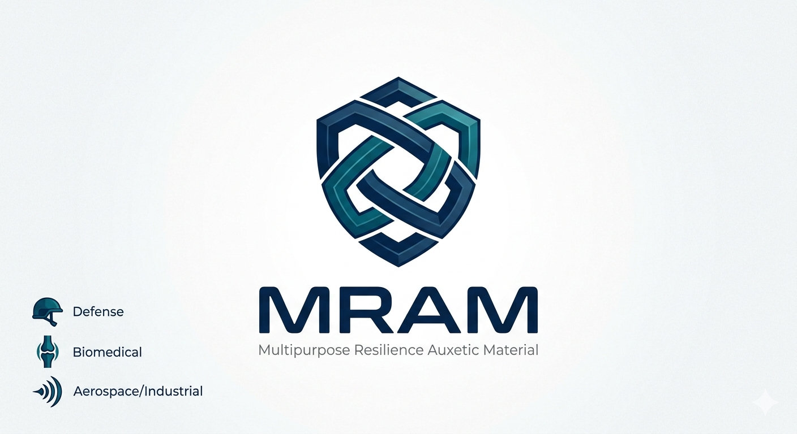

# MRAM — Multipurpose Resilience Auxetic Material

  

## Plataforma de Metamateriais Auxéticos para Dissipação Programada de Energia

### Visão Geral

**MRAM (Multipurpose Resilience Auxetic Material)** é uma plataforma experimental de engenharia de metamateriais baseada em estruturas auxéticas reentrantes com comportamento mecânico adaptativo.

O projeto investiga geometrias parametrizadas capazes de redistribuir deformações e dissipar energia mecânica através de arquiteturas celulares otimizadas para fabricação aditiva.

**A tecnologia encontra-se atualmente em fase de prototipagem funcional e validação experimental preliminar.**

---

### Objetivo Tecnológico

O núcleo estrutural do projeto MRAM foi concebido como uma **plataforma multissetorial de absorção de impacto, dissipação de energia e controle deformacional programado**.

A arquitetura geométrica pode apresentar aplicações potenciais em:

- proteção mecânica;
- sistemas de absorção de impacto;
- biomecânica;
- dispositivos médicos expansíveis;
- estruturas aeroespaciais leves;
- amortecimento vibracional;
- isolamento mecânico;
- engenharia industrial;
- sistemas multicamadas de proteção;
- estruturas adaptativas.

---

### Estrutura Técnica

O projeto utiliza:

- geometrias auxéticas reentrantes;
- modelagem paramétrica;
- fabricação aditiva;
- prototipagem experimental;
- análise computacional preliminar;
- estudos de deformação controlada.

**Protótipos iniciais estão sendo fabricados em TPU Shore 95A para avaliação mecânica exploratória.**

---

### Estado de Desenvolvimento

- CAD paramétrico em desenvolvimento;
- protótipos físicos em fabricação;
- ensaios experimentais preliminares em preparação;
- documentação técnica em consolidação;
- processo de proteção intelectual em andamento.

---

### Propriedade Intelectual

**Este repositório possui finalidade exclusivamente documental e de rastreabilidade temporal.**

Parâmetros críticos de engenharia, algoritmos, geometrias completas, arquivos industriais e métodos proprietários permanecem **parcialmente restritos até eventual formalização de proteção intelectual aplicável**.

---

### Aviso

**Experimental technology under development.**

This repository does not grant permission for commercial reproduction, industrial replication, or derivative patent filing based on unpublished proprietary parameters.

**All rights reserved.**

---

**Autoria:** Francielle K. P. Calazans  
**Commit raiz K1-StreetSafe:** `2ec2895` - 14/04/2026  
**DOI Zenodo:** [10.5281/zenodo.16750937](https://doi.org/10.5281/zenodo.16750937)  
**Contato Licenciamento:** mrammotooficial@gmail.com
